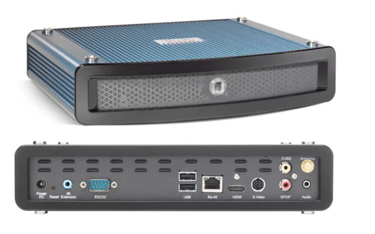
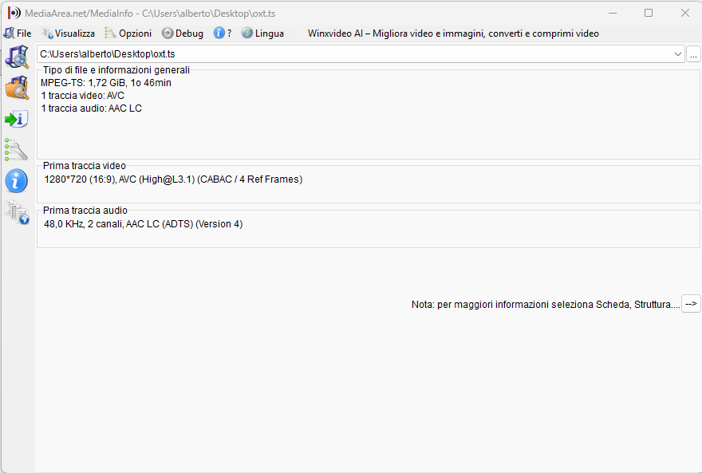
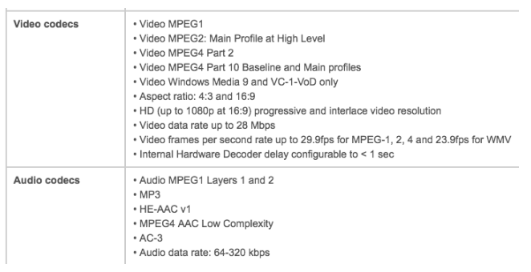

# Cisco DMP 4400

## How configure a Cisco 4400 Digital Media Player to show remote multicast rtsp video flows.

### My 4400 Firmware Release Version is 5.2

### Factory reset

If you don't have the admin password you can factory reset the 4400

- connecting it to a dhcp enabled neteork
- powering up it
- waiting boot complete
- press the back reset button until the system reboot
- connect the 4400 to a hdmi video and read the dhcp asigned tcp/ip address
- connect to it in https with a flash player enabled browser ( see down )
- user: admin
- password: default

### Install an enabled flash player browser

- install Pale Moon 32 bit windows browser ( I used 33.9.1 )
- install windows flash player, installer is on resources folder.
- connect to https://your_4400_ip

### Play rtsp multicast file

- inslall ffmpeg
- Start the multicast file send in cmd

ffmpeg -re -i "yourfile.mkv" -localaddr 192.168.2.5 -f mpegts -vcodec libx264 -acodec aac "udp://239.1.2.3:4567?ttl=8"

- in the localaddr param replace 192.168.2.5 with your interface ip
- in your 4400 browser interface / Display Actions /Video multicast insert
  - Multicast Group IP Address: 239.1.2.3
  - port Number: 4567
  - press the **Start** button
- the hdmi attached tv should play video e audio
  
### Auto play at 4400 boot

- you can show a html page on 4400 boot
- in Basic / Browser insert the page
  - http://<ip_address>/<path_and_filename> from a webserver
  - file:///tmp/ftproot/usb_1/<path_and_filename> from internal storage
  - file:///tmp/ftproot/usb_2/<path_and_filename> from usb attached disk
- you can play a video on 4400 boot
  - in Basic / Media
    - ~~udp:<ip_address_of_multicast_server>/<port_number>~~ tested but don't work
  
### Local media file encoding

files must be a MPEG-TS

better quality is with mpeg4 / AVC / h264

